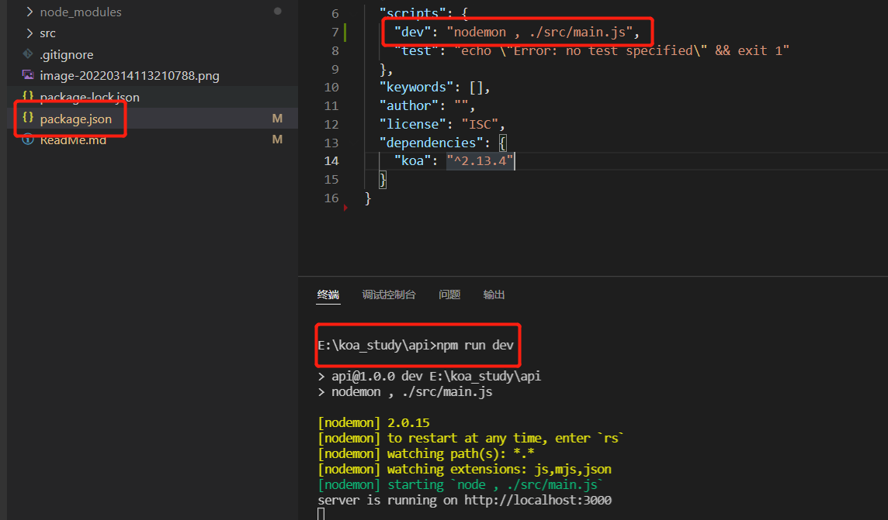
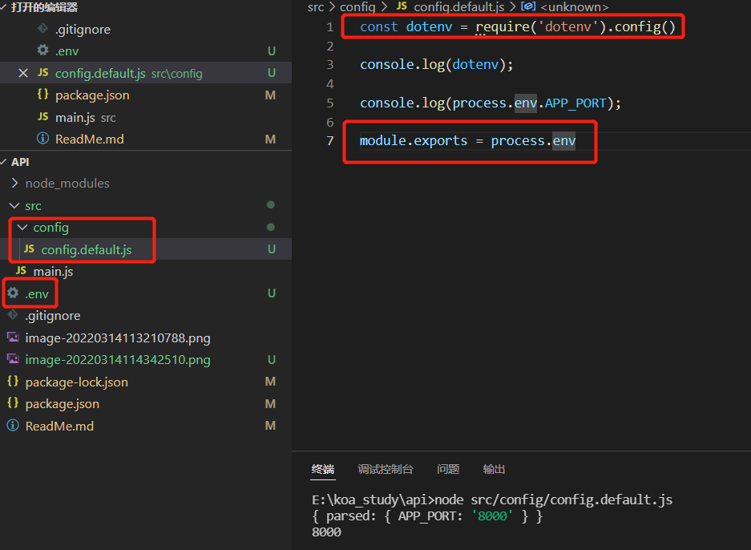
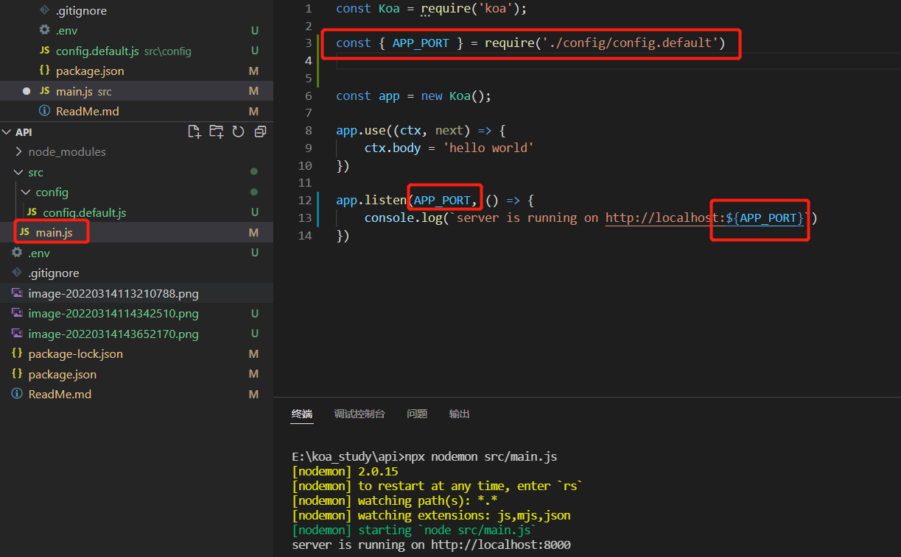
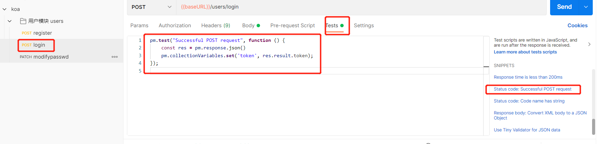
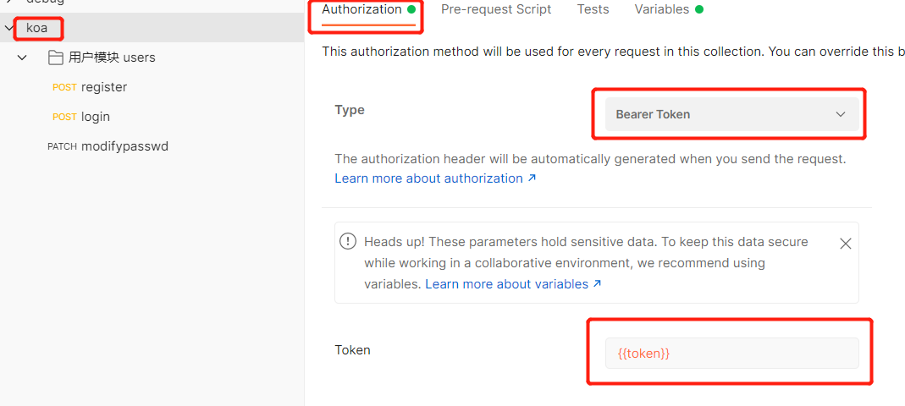
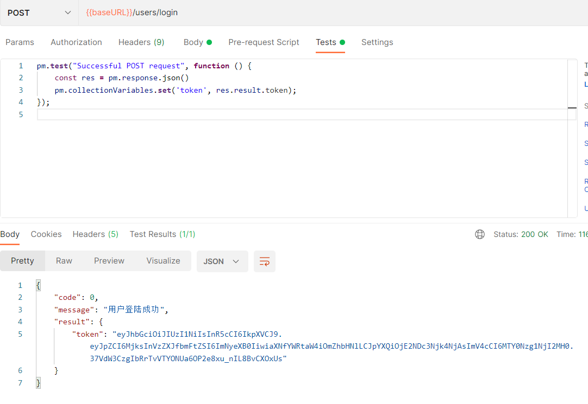
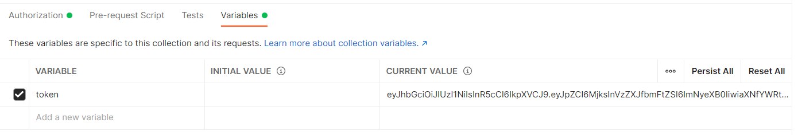
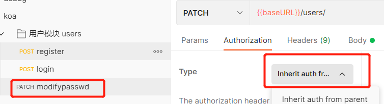

# 一、项目的初始化

## 1 npm初始化

```js
npm init -y
```

生成`package.json`文件：

- 记录项目的依赖

## 2 git的初始化

```
git init
```

生成git隐藏文件夹，git的本地仓库

## 3 创建ReadMe文件

# 二、搭建项目

## 1 安装Koa框架

```js
npm i koa
```

## 2 编写最基本的app

创建`src/main.js`

```js
const Koa = require('koa');

const app = new Koa();

app.use((ctx, next) => {
    ctx.body = 'hello world'
})

app.listen(3000, () => {
    console.log('server is running on http://localhost:3000')
})
```

## 3 测试

终端使用`node src/main.js`启动服务，用浏览器或postman访问


# 三、项目的基本优化

## 1 自动重启服务

安装`nodemon`工具

```
npm i nodemon
```

`npx nodemon xxx` 可以先运行全局的`nodemon`版本，没有再运行局部的版本

`package.json`里插入脚本

```
"dev": "nodemon , ./src/main.js"
```

执行`npm run dev` 启动服务



### 2 读取配置文件

安装`dotenv`，可以从根目录`.env`文件里去读取环境变量

```
npm i dotenv
```

根目录新建`.env`文件，写入

```
APP_PORT = 8000
```

在新建`src/config/config.default.js`文件，写入

```
const dotenv = require('dotenv').config()
module.exports = process.env
```

当在拥有.env环境变量配置文件的路径下使用命令时，会将该.env目录下的配置加载到process.env进程的环境变量里



在`main.js`中导入`config.default.js`文件




## 四、添加路由

路由：根据不同的URL和METHOD，调用不同的处理函数

### 1 安装koa-router

```
npm i koa-router
```

### 2 编写路由

创建`src/router`目录，编写`user.route.js`

```
const Router = require('koa-router')
const router = new Router({ prefix: '/users' })  //路由对象初始化时增加一个前缀

router.get('/', (ctx, next) => {
    ctx.body = 'hello world'
})

module.exports = router;
```

`main.js`文件下，导入路由模块，并注册到中间件

```
const Koa = require('koa');
const app = new Koa();
const { APP_PORT } = require('./config/config.default')
const userRouter = require('./router/user.route')      //加载路由模块      

app.use(userRouter.routes())                          //注册中间件

app.listen(APP_PORT, () => {
    console.log(`server is running on http://localhost:${APP_PORT}`)
})
```

## 五、目录结构优化

### 1、将http服务和app业务拆分

创建`src/app/index.js`

```
const Koa = require('koa');
const app = new Koa();
const userRouter = require('../router/user.route')
app.use(userRouter.routes())

module.exports = app
```

修改`main.js`

```
const { APP_PORT } = require('./config/config.default')
const app = require('./app/index')

app.listen(APP_PORT, () => {
    console.log(`server is running on http://localhost:${APP_PORT}`)
})
```

## 2、将路由和控制器拆分

路由：解析URL，分布给控制器对应的方法

控制器：处理不同的业务

改写`user.route.js`

```
const Router = require('koa-router')

const { register, login } = require('../controller/user.controller')

const router = new Router({ prefix: '/users' })

router.post('/register', register)

router.post('/login', login)

module.exports = router;
```

创建`controller/user.controller.js`

```
class UserController {
    async register(ctx, next) {
        ctx.body = '用户注册成功'
    }

    async login(ctx, next) {
        ctx.body = '用户登陆成功'
    }
}

module.exports = new UserController()
```

## 六、解析body

### 1 安装koa-body

```
npm i koa-body
```

### 2 注册中间件

改写`app/index.js`

```
const Koa = require('koa');
const KoaBody = require('koa-body')		//导入koa-body
const app = new Koa();
const userRouter = require('../router/user.route')

app.use(KoaBody())                       //注册
    .use(userRouter.routes())

module.exports = app
```

### 3 解析请求的body

```
const { user_name, password } = ctx.request.body
```

### 4 拆分service层

service层主要是做数据库处理（或其他第三方服务交互）

创建`src/service/user.service.js`

```
class UserService {
    async createUser(user_name, password) {
        return '写入数据库成功'
    }
}

module.exports = new UserService()
```

## 七、数据库操作

sequelize ORM数据库工具

ORM：对象关系映射

- 数据表映射（对应）一个类
- 数据表中的数据行（记录）对应一个对象
- 数据表字段对应对象的属性
- 数据表的操作对应对象的方法

### 1 安装sequelize

```
npm i mysql2 sequelize
```

### 2 连接数据库

`src/db/seq.js`

```
const { Sequelize } = require('sequelize');

const {
    MYSQL_HOST,
    MYSQL_PORT,
    MYSQL_USER,
    MYSQL_PWD,
    MYSQL_DB
} = require('../config/config.default')

const seq = new Sequelize(
    MYSQL_DB, MYSQL_USER, MYSQL_PWD, {
    host: MYSQL_HOST,
    dialect: 'mysql'
})


seq.authenticate().then(() => {
    console.log('数据库连接成功')
}).catch(err => {
    console.log('数据库连接失败', err);
})

module.exports = seq
```

### 3、建表

src/model/user.model.js

```
const { DataTypes } = require('sequelize')
const seq = require('../db/seq')

//可以去sequelize官网查看如何使用
//创建模型，表明结尾会自动附带s（model zd_user -> zd_users），建表

const User = seq.define('zd_user', {
    //id会被自动创建
    user_name: {
        type: DataTypes.STRING,
        allowsNull: false,
        unique: true,
        comment: '用户名,唯一'
    },
    password: {
        type: DataTypes.CHAR,
        allowNull: false,
        unique: false,
        comment: '密码'
    },
    is_admin: {
        type: DataTypes.BOOLEAN,
        allowNull: false,
        defaultValue: 0,
        comment: '是否为管理员,0:不是管理员(默认),1:是管理员'
    }
},
    /* //timestamps:false 可以不要时间戳
    {
        timestamps: false
    } */
)

//创建完数据表后可以注释掉
// User.sync({ force: true })

module.exports = User


```

# 八、添加用户入库

通过请求`/users/register`接口，调用`/controller/user.controller.js`下register方法，注册用户，存入数据库`service/user.service.js`下createUser方法

```
const { createUser } = require('../service/user.service')

class UserController {
    async register(ctx, next) {
    	//1、获取数据
        const { user_name, password } = ctx.request.body
        //2、操作数据库
        const res = await createUser(user_name, password)
        //3、返回结果
        ctx.body = {
            code: 0,
            message: '用户注册成功',
            result: {
                id: res.id,
                user_name: res.user_name,
            }
        }
    }

    async login(ctx, next) {
        ctx.body = '用户登陆成功'
    }
}

module.exports = new UserController()
```

# 九、参数的校验

### 1、对传参的合理性和合法性校验

```
const { createUser, getUserInfo } = require('../service/user.service')

class UserController {
    async register(ctx, next) {
        //1、获取数据
        const { user_name, password } = ctx.request.body
        //验证输入数据的合法性，用户名或密码为空的情况
        if (!user_name || !password) {
            console.error('用户名或密码为空', ctx.request.body)
            ctx.status = 400
            ctx.body = {
                code: '10001',
                message: '用户名或密码为空',
                result: ''
            }
            return
        }

        //验证数据的合法性，比如创建了相同的用户
        //查询数据库，如果返回了用户信息，则返回409，请求的资源存在冲突
        if (await getUserInfo({ user_name })) {
            ctx.status = 409          
            ctx.body = {
                code: '10002',
                message: "用户已存在",
                result: ''
            }
            return
        }


        //2、操作数据库
        const res = await createUser(user_name, password)
        //3、返回结果
        ctx.body = {
            code: 0,
            message: '用户注册成功',
            result: {
                id: res.id,
                user_name: res.user_name,
            }
        }
    }

    async login(ctx, next) {
        ctx.body = '用户登陆成功'
    }
}

module.exports = new UserController()
```

# 十、拆分中间件——错误处理

### 1 将参数校验单独来出来

创建`src\middleware\user.middleware.js`用于编写用户相关中间件，如参数校验，将原本写于controller下的参数校验封装在此处

```
const { getUserInfo } = require('../service/user.service')

const userValidator = async (ctx, next) => {
    //验证注册用户输入数据的合法性，用户名或密码为空的情况
    const { user_name, password } = ctx.request.body

    if (!user_name || !password) {
        console.error('用户名或密码为空', ctx.request.body)
        ctx.status = 400
        ctx.body = {
            code: '10001',
            message: '用户名或密码为空',
            result: ''
        }
        return
    }

    await next()
}

const varifyUser = async (ctx, next) => {
    const { user_name } = ctx.request.body
    //验证数据的合法性，比如创建了相同的用户
    //查询数据库，如果返回了用户信息，则返回409,请求的资源存在冲突
    if (await getUserInfo({ user_name })) {
        ctx.status = 409          
        ctx.body = {
            code: '10002',
            message: "用户已存在",
            result: ''
        }
        return
    }
    await next()
}

module.exports = {
    userValidator,
    varifyUser
}
```

### 2 参数校验放在后台业务处理之前

`user.route.js`下，/register 路由下register执行之前，先进行参数校验

```
const Router = require('koa-router')

const { userValidator, varifyUser } = require('../middleware/user.middleware')
const { register, login } = require('../controller/user.controller')

const router = new Router({ prefix: '/users' })

router.post('/register', userValidator, varifyUser, register)

router.post('/login', login)

module.exports = router;
```

### 3 将错误返回的状态码和返回信息封装成常量

`src\constant\err.type.js`下模块化输出常量：

```
module.exports = {
    userFormateError: {
        code: '10001',
        message: '用户名或密码为空',
        result: ''
    },
    userAlreadyExisted: {
        code: '10002',
        message: "用户已存在",
        result: ''
    }
}
```

### 4 将错误抛出后进行统一处理

通过`ctx.app.emit('error'/* 错误事件 */, error/* 错误内容(对象) */, ctx/* 传参用于使用ctx对象里的属性 */)`抛出异常

`user.middleware.js`:

```
const { getUserInfo } = require('../service/user.service')
const { userFormateError, userAlreadyExisted } = require('../constant/err.type')

const userValidator = async (ctx, next) => {
    //验证注册用户输入数据的合法性，用户名或密码为空的情况
    const { user_name, password } = ctx.request.body

    if (!user_name || !password) {
        console.error('用户名或密码为空', ctx.request.body)
        ctx.app.emit('error', userFormateError, ctx)         //change
        return
    }

    await next()
}

const varifyUser = async (ctx, next) => {
    const { user_name } = ctx.request.body
    //验证数据的合法性，比如创建了相同的用户
    //查询数据库，如果返回了用户信息，则返回409,请求的资源存在冲突
    if (await getUserInfo({ user_name })) {
        ctx.app.emit('error', userAlreadyExisted, ctx)           //change
        return
    }
    await next()
}

module.exports = {
    userValidator,
    varifyUser
}
```

`src\app\index.js`下通过`app.on('error'/* 监听到的错误事件 */, callback(error, ctx))`处理错误

```
const Koa = require('koa');
const KoaBody = require('koa-body')
const app = new Koa();
const userRouter = require('../router/user.route')
const errHandler = require('./errHandler')

app
    .use(KoaBody())
    .use(userRouter.routes())

app.on('error'/* 监听到的错误事件 */, (error, ctx) => {
    let status = 500
    switch (error.code) {
        case '10001':
            status = 400
            break
        case '10002':
            status = 400
            break
        default:
            status = 500
    }
    ctx.status = status;
    ctx.body = error
})

module.exports = app
```

创建一个`src\app\errHandler.js`用于集中返回错误信息，将app.on...里的内容写入

```
module.exports = (error, ctx) => {
    let status = 500
    switch (error.code) {
        case '10001':
            status = 400
            break
        case '10002':
            status = 400
            break
        default:
            status = 500
    }
    ctx.status = status;
    ctx.body = error
}
```

原`src\app\index.js`下：

```
const Koa = require('koa');
const KoaBody = require('koa-body')
const app = new Koa();
const userRouter = require('../router/user.route')
const errHandler = require('./errHandler')

app
    .use(KoaBody())
    .use(userRouter.routes())

app.on('error'/* 监听到的错误事件 */, errHandler)

module.exports = app
```

# 十一、加密

密保保存到数据库之前，对密码进行加密处理

常用加密处理方式：

- 加盐加密：

  原始明文：123

  加盐：cdf123abc

  hash加密处理

### 1 安装bcryptjs

```
npm i bcryptjs
```

### 2 对传入的密码进行加密，放在存入数据库之前

`src\middleware\user.middleware.js`下增加

```
const crpytPassword = async (ctx, next) => {
    const { password } = ctx.request.body

    const salt = bcrypt.genSaltSync(10);
    //hash保存的是密文
    const hash = bcrypt.hashSync(password, salt)

    ctx.request.body.password = hash

    await next()

}
```

`src\router\user.route.js`下导入，加载在注册之前

```
const Router = require('koa-router')

const { userValidator, varifyUser, crpytPassword } = require('../middleware/user.middleware')
const { register, login } = require('../controller/user.controller')

const router = new Router({ prefix: '/users' })

router.post('/register', userValidator, varifyUser, crpytPassword, register)

router.post('/login', login)

module.exports = router;
```

# 十二、登陆

### 1 账号密码校验

`src\middleware\user.middleware.js`下增加用户名和密码一致性的校验

```
const verifyLogin = async (ctx, next) => {

    //1、判断用户是否存在，不存在则报错
    const { user_name, password } = ctx.request.body
    try {
        const res = await getUserInfo({ user_name })
        if (!res) {
            console.error('用户名不存在', { user_name })
            ctx.app.emit('error', userDoesNotExist, ctx)
            return
        }

        //2、用户输入的密码和数据库密码是否匹配，不匹配则报错
        if (!bcrypt.compareSync(password, res.password)) {
            ctx.app.emit('error', invalidPassword, ctx)
            return
        }
    } catch (err) {
        console.error(err)
        ctx.app.emit('error', userLoginError, ctx)
        return
    }

    await next()
}
```

`src\constant\err.type.js`下增加userLoginError、invalidPassword错误码

```
userLoginError: {
        code: '10005',
        message: '用户登陆失败',
        result: ''
    },
    invalidPassword: {
        code: '10006',
        message: '用户密码不匹配',
        result: ''
    },
```

`src\router\user.route.js`下login之前增加用户名参数校验和用户名、密码一致性校验

```
const Router = require('koa-router')

const { userValidator, varifyUser, crpytPassword, verifyLogin } = require('../middleware/user.middleware')
const { register, login } = require('../controller/user.controller')

const router = new Router({ prefix: '/users' })

router.post('/register', userValidator, varifyUser, crpytPassword, register)

router.post('/login', userValidator, verifyLogin, login)

module.exports = router;
```

# 十三、用户认证

用户登陆成功后，给用户版发一个令牌token，用户在以后的每一次请求中携带这个令牌

jwt：Json Web Token

- header：头部
- payload：载荷
- signature：签名

### 1 安装jsonwebtoken

```
npm i jsonwebtoken
```

### 2 版发令牌

`.env`下增加环境变量`JWT_SECRET = xzd`

`src\controller\user.controller.js`下引入jsonwebtoken、环境变量，修改login方法

```
const jwt = require('jsonwebtoken')

const { userRegisterError } = require('../constant/err.type')
const { createUser, getUserInfo } = require('../service/user.service')

const { JWT_SECRET } = require('../config/config.default')

class UserController {
    async register(ctx, next) {
        //1、获取数据
        const { user_name, password } = ctx.request.body

        //2、操作数据库
        try {
            const res = await createUser(user_name, password)
            //3、返回结果
            ctx.body = {
                code: 0,
                message: '用户注册成功',
                result: {
                    id: res.id,
                    user_name: res.user_name,
                }
            }
        } catch (err) {
            console.error('获取用户信息错误', err);
            ctx.app.emit('error', userRegisterError, ctx)
            return
        }
    }

    async login(ctx, next) {
        const { user_name } = ctx.request.body
        // 1、获取用户信息（在token的payload中，要记录id,user_name,is_admin等信息）
        try {
            //从返回结果对象中剔除password属性，将剩下的属性放在res对象里
            const { password, ...res } = await getUserInfo({ user_name })
            ctx.body = {
                code: 0,
                message: '用户登陆成功',
                result: {
                    token: jwt.sign(res, JWT_SECRET, { expiresIn: '1d' })
                }
            }
        } catch (err) {
            console.error('用户登陆失败', err);
        }
    }
}

module.exports = new UserController()
```

### 3 用户认证

### 1 解析token

`src\middleware\auth.middleware.js`下写入：

```
const jwt = require('jsonwebtoken')

const { JWT_SECRET } = require('../config/config.default')
const { tokenExpiredError, invalidToken } = require('../constant/err.type')

const auth = async (ctx, next) => {
    const { user_name } = ctx.request.body
    //拿到请求携带的令牌
    const { authorization } = ctx.header
    //去掉开头的'Bearer '部分
    const token = authorization.replace('Bearer ', '')
    console.log(token)
    try {
        //解析token
        const user = jwt.verify(token, JWT_SECRET)
        //将user信息存入ctx上下文对象
        ctx.user = {}
        ctx.user.tokenDecode = user
    } catch (err) {
        switch (err.name) {
            case 'TokenExpiredError':
                console.error('token已过期', err)
                ctx.app.emit('error', tokenExpiredError, ctx)
                return
            case 'JsonWebTokenError':
                console.error('无效的token', err)
                ctx.app.emit('error', invalidToken, ctx)
                return
        }
        console.log(err)
    }

    await next()
}

module.exports = {
    auth
}
```

`src\constant\err.type.js`下增加tokenExpiredError、invalidToken错误码信息

```
tokenExpiredError: {
        code: '10101',
        message: 'token过期',
        result: ''
    },
    invalidToken: {
        code: '10102',
        message: '无效的token',
        result: ''
    }
```

`src\router\user.route.js`下增加router.path，新增auth方法解析token，判断用户是否是登录状态

```
const Router = require('koa-router')

const { userValidator, varifyUser, crpytPassword, verifyLogin } = require('../middleware/user.middleware')
const { register, login } = require('../controller/user.controller')
const { auth } = require('../middleware/auth.middleware')

const router = new Router({ prefix: '/users' })

router.post('/register', userValidator, varifyUser, crpytPassword, register)

router.post('/login', userValidator, verifyLogin, login)

router.patch('/', auth, async (ctx, next) => {
    console.log(ctx.user.tokenDecode)
    ctx.body = '修改密码成功'
})

module.exports = router;
```

PS：postman获取登陆接口返回的token并设置为全局变量：

①登陆用例Tests写下如下代码：

```
pm.test("Successful POST request", function () {
    const res = pm.response.json()
    pm.collectionVariables.set('token', res.result.token);
});
```



②在整个项目的Authorization下设置Bearer Token：



③执行login接口请求



④在整个项目的Variables已经提取到变量，说明设置成功，在其他接口使用默认的Inherit...继承即可使用此token





### 2 更新数据库里密码

思路：拿到登陆的token里的用户id信息（唯一），根据id去数据库查询对应的记录，然后修改密码

`src\controller\user.controller.js`下增加changePassword方法：

```
async changePassword(ctx, next) {
        //1、获取数据，通过拿到解析的token里的id，找到指定的数据库记录
        const id = ctx.user.tokenDecode.id
        //接收要修改的密码
        const { password } = ctx.request.body
        //2、操作数据库
        if (await updateById({ id, password })) {//3、返回结果
            ctx.body = {
                code: 0,
                message: '修改密码成功',
                result: ''
            }
        } else {
            ctx.body = {
                code: '10007',
                message: '修改密码失败',
                result: ''
            }
        }

    }
```

`src\service\user.service.js`下增加updateById方法：

```
async updateById({ id, user_name, password, is_admin }) {
        const whereOpt = { id }
        const newUser = {}

        user_name && Object.assign(newUser, { user_name })
        password && Object.assign(newUser, { password })
        is_admin && Object.assign(newUser, { is_admin })
        const res = await User.update(newUser, { where: whereOpt })
        //返回如果是[0]，则表示没有修改密码，前后密码一致，因为前置有加密，基本不太可能出现这种情况
        return res[0] > 0 ? true : false
    }
```

# 十四、上传图片

### 1 查询管理员权限（授权），只允许管理员上传文件

前置：可以用updateById方法设置管理员权限，或者自己手动修改数据库记录赋予admin账号管理员权限

`src\middleware\auth.middleware.js`下增加hasAdminPermission方法判断用户是否有管理员权限

```
const hasAdminPermission = async (ctx, next) => {

    const is_admin = ctx.user.tokenDecode.is_admin
    if (!is_admin) {
        console.error('该用户没有管理员权限')
        ctx.app.emit('error', hasNotAdminPermission, ctx)
        return
    }

    await next()
}
```

新建`src\router\goods.router.js`，写入：（upload方法先简单写个字符串返回即可）

```
const Router = require('koa-router')

const { upload } = require('../controller/goods.controller')
const { auth, hasAdminPermission } = require('../middleware/auth.middleware')

const router = new Router({ prefix: '/goods' })

router.post('/upload', auth, hasAdminPermission, upload)

module.exports = router
```

PS：新增`src\router\index.js`文件，读取当前文件夹下其他路由文件名，然后统一加载到一个路由对象上

```
const fs = require('fs')

const Router = require('koa-router')

const router = new Router()

fs.readdirSync(__dirname).forEach(file => {
    // console.log(file)
    if (file != 'index.js') { //加载当前目录下的除了index.js的文件里导出的router实例对象
        let r = require('./' + file)
        // router对象也支持use方法注册中间件
        router.use(r.routes())
    }
})

module.exports = router
```

`src\app\index.js`下加载

```
const Koa = require('koa');
const KoaBody = require('koa-body')

const router = require('../router/index');
const errHandler = require('./errHandler');

const app = new Koa();

app
    .use(KoaBody())
    .use(router.routes())

app.on('error'/* 监听到的错误事件 */, errHandler)

module.exports = app
```

### 2 koa-body开启multipart配置选项

修改`src\app\index.js`文件KoaBody配置

```
const path = require('path')

const Koa = require('koa');
const KoaBody = require('koa-body')

const router = require('../router/index');
const errHandler = require('./errHandler');

const app = new Koa();

app
    .use(KoaBody({
        multipart: true,      //上传文件必须开启
        formidable: {
        	//文件存放地址，配置里不推荐使用相对路径，相对路径是相对于进程api里process.cwd()的路径而言
            uploadDir: path.join(__dirname, '../upload'), 
            keepExtensions: true,                   //保留文件的后缀名
        }
    }))
    .use(router.routes())

app.on('error'/* 监听到的错误事件 */, errHandler)

module.exports = app
```

修改`src\controller\goods.controller.js`下upload方法：

```
const path = require("path")

const { fileUploadError, unSupportedFileType } = require('../constant/err.type')

class GoodsController {
    async upload(ctx, next) {
        const { file } = ctx.request.files
        const fileTypes = ['image/jpeg', 'image/png']
        if (file) {
            if (!fileTypes.includes(file.type)) { //虽然代码限制了，但实际还是会上传成功，需要配置formidable
                ctx.app.emit('error', unSupportedFileType, ctx)
                return
            }
            ctx.body = {
                code: 0,
                message: '图片上传成功',
                result: {
                    goods_img: path.basename(file.path)
                }
            }
        } else {
            ctx.app.emit('error', fileUploadError, ctx)
            return
        }

    }
}

module.exports = new GoodsController()
```

# 十五、访问静态资源

### 1 安装koa-static插件

```
npm i koa-static
```

### 2 `src\app\index.js`下注册中间件

```
const path = require('path')

const Koa = require('koa');
const KoaBody = require('koa-body')
const koaStatic = require('koa-static')

const router = require('../router/index');
const errHandler = require('./errHandler');

const app = new Koa();

app
    .use(KoaBody({
        multipart: true,      //上传文件必须开启
        formidable: {
            uploadDir: path.join(__dirname, '../upload'), //文件存放地址，配置里不推荐使用相对路径，相对路径是相对于进程api里process.cwd()的路径而言
            keepExtensions: true,                   //保留文件的后缀名
        }
    }))
    .use(koaStatic(path.join(__dirname, '../upload')))
    .use(router.routes())

app.on('error'/* 监听到的错误事件 */, errHandler)

module.exports = app
```

### 3 输入地址访问静态资源

```
http://localhost:8000/upload_6bce9d5ee19d4a168abe351c13202d97.png
```

# 十六、发布商品

### 1 安装koa-parameter，做参数校验

```
npm i koa-parameter
```

### 2 注册koa-parameter，放在路由中间件注册之前

在`src\app\index.js`下：

```
const path = require('path')

const Koa = require('koa');
const KoaBody = require('koa-body')
const koaStatic = require('koa-static')
const parameter = require('koa-parameter')

const router = require('../router/index');
const errHandler = require('./errHandler');

const app = new Koa();

app
    .use(KoaBody({
        multipart: true,      //上传文件必须开启
        formidable: {
            uploadDir: path.join(__dirname, '../upload'), //文件存放地址，配置里不推荐使用相对路径，相对路径是相对于进程api里process.cwd()的路径而言
            keepExtensions: true,                   //保留文件的后缀名
        }
    }))
    .use(koaStatic(path.join(__dirname, '../upload')))
    .use.use(parameter(app))
    .use(router.routes())

app.on('error'/* 监听到的错误事件 */, errHandler)

module.exports = app
```

### 3 对传参进行校验

`src\middleware\goods.middleware.js`下：

```
const { goodsFormatError } = require('../constant/err.type')


const validator = async (ctx, next) => {
    try {
        ctx.verifyParams({
            goods_name: { type: 'string', required: true },
            goods_price: { type: 'number', required: true },
            goods_num: { type: 'number', required: true },
            goods_img: { type: 'string', required: true }
        })
    } catch (err) {
        console.error(err)
        goodsFormatError.result = err.errors
        ctx.app.emit('error', goodsFormatError, ctx)
        return
    }

    await next()
}

module.exports = {
    validator
}
```

`src\constant\err.type.js`下增加goodsFormatError：

```
goodsFormatError: {
        code: '10203',
        message: '参数格式错误',
        result: ''
    },
```

`src\router\goods.router.js`下增加：

```
router.post('/', auth, hasAdminPermission, validator, ctx => {
    ctx.body = '发布商品成功'
})
```

# 十七、修改商品

`goods.router.js`下增加路由：

```
router.put('/:id', auth, hasAdminPermission, validator, update)
```

`src\controller\goods.controller.js`下增加update方法：

```
async update(ctx) {
        try {
            const res = await updateGoods(ctx.params.id, ctx.request.body)
            if (res) {
                ctx.body = {
                    code: 0,
                    message: '修改商品成功',
                    result: ''
                }
            } else {
                ctx.app.emit('error', invalidGoodsID, ctx)
                return
            }
        } catch (error) {
            console.error(error)
        }
    }
```

`src\service\goods.service.js`下增加updateGoods方法：

```
const Goods = require('../model/goods.model')

class GoodsServoce {
    async createGoods(goods) {
        const res = await Goods.create(goods)
        return res.dataValues
    }

    async updateGoods(id, goods) {
        const res = await Goods.update(goods, { where: { id } })
        return res[0] > 0 ? true : false
    }
}

module.exports = new GoodsServoce()
```

# 十八、删除商品

`goods.router.js`下增加路由：

```
router.delete('/:id', auth, hasAdminPermission, remove)
```

`src\controller\goods.controller.js`下增加remove方法：

```
async remove(ctx) {
        const res = await removeGoods(ctx.params.id)
        ctx.body = {
            code: 0,
            message: '删除商品成功',
            result: ''
        }
    }
```

`src\service\goods.service.js`下增加removeGoods方法：

```
async removeGoods(id) {
        const res = await Goods.destroy({ where: { id } })
        return res[0] > 0 ? true : false
    }
```

# 十九、下架、上架商品

### 1 重新建表，增加一个字段

`src\model\goods.model.js`下增加一个参数paranoid，node执行，重新创建表会增加一个deletedAt字段

```
const { DataTypes } = require('sequelize')

const seq = require('../db/seq')


const Goods = seq.define('zd_goods', {
    goods_name: {
        type: DataTypes.STRING,
        allowNull: false,
        comment: '商品名称'
    },
    goods_price: {
        type: DataTypes.DECIMAL(10, 2),
        allowNull: false,
        comment: '商品价格'
    },
    goods_num: {
        type: DataTypes.INTEGER,
        allowNull: false,
        comment: '商品库存'
    },
    goods_img: {
        type: DataTypes.STRING,
        allowNull: false,
        comment: '商品图片的url'
    }
}, {
    paranoid: true
})

//创建完数据表后可以注释掉
Goods.sync({ force: true })

module.exports = Goods

```

### 2 写下方法

`goods.router.js`下增加路由：

```
//软删除，重新建表增加了deletedAt字段，删除只会更新deletedAt字段
router.post('/:id/off', auth, hasAdminPermission, offline)

router.post('/:id/on', auth, hasAdminPermission, restore)
```

`src\controller\goods.controller.js`下增加offline、restore方法：

```
async offline(ctx) {
        const res = await offlineGoods(ctx.params.id)
        if (res) {
            ctx.body = {
                code: 0,
                message: '下架商品成功',
                result: ''
            }
        } else {
            ctx.app.emit('error', invalidGoodsID, ctx)
            return
        }
    }

    async restore(ctx) {
        const res = await restoreGoods(ctx.params.id)
        if (res) {
            ctx.body = {
                code: 0,
                message: '上架商品成功',
                result: ''
            }
        } else {
            ctx.app.emit('error', invalidGoodsID, ctx)
            return
        }
    }
```

`src\service\goods.service.js`下增加offlineGoods、restoreGoods方法：

```
async offlineGoods(id) {
        const res = await Goods.destroy({ where: { id } })
        return res > 0 ? true : false
    }

    async restoreGoods(id) {
        const res = await Goods.restore({ where: { id } })
        return res > 0 ? true : false
    }
```

# 二十、获取商品列表

`goods.router.js`下增加路由：

```
//获取商品列表
router.get('/', findAll)
```

`src\controller\goods.controller.js`下增加findAll方法：

```
async findAll(ctx) {
        //1、解析pageNum pageSize
        const { pageNum = 1, pageSize = 10 } = ctx.request.query
        //2、调用数据处理的相关方法
        const res = await findGoods(pageNum, pageSize)
        //3、返回结果
        ctx.body = {
            code: 0,
            message: '获取商品列表成功',
            result: res
        }
    }
```

`src\service\goods.service.js`下增加findGoods方法：

```
async findGoods(pageNum, pageSize) {
        /* //1、获取总数
        const count = await Goods.count()        //会自动去除软删除的数据
        //2、获取分页的数据，获取当前页的pagesize数量的记录
        const offset = (pageNum - 1) * pageSize
        const rows = await Goods.findAll({ offset: offset, limit: pageSize * 1 })
         */

        //或者直接用接口提供的方法：
        const offset = (pageNum - 1) * pageSize
        const { count, rows } = await Goods.findAndCountAll({ offset, limit: pageSize * 1 })
        return {
            pageNum,
            pageSize,
            total: count,
            list: rows
        }
    }
```

