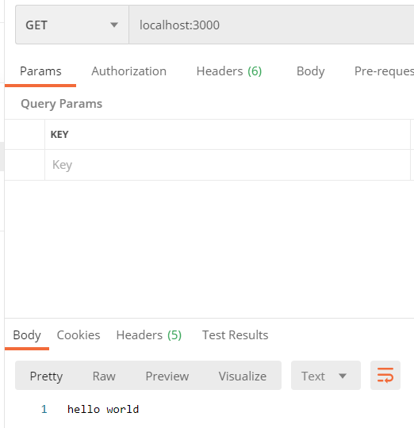

# 一、项目的初始化

## 1 npm初始化

```js
npm init -y
```

生成`package.json`文件：

- 记录项目的依赖

## 2 git的初始化

```
git init
```

生成git隐藏文件夹，git的本地仓库

## 3 创建ReadMe文件

# 二、搭建项目

## 1 安装Koa框架

```js
npm i koa
```

## 2 编写最基本的app

创建`src/main.js`

```js
const Koa = require('koa');

const app = new Koa();

app.use((ctx, next) => {
    ctx.body = 'hello world'
})

app.listen(3000, () => {
    console.log('server is running on http://localhost:3000')
})
```

## 3 测试

终端使用`node src/main.js`启动服务，用浏览器或postman访问



# 三、项目的基本优化

## 1 自动重启服务

安装`nodemon`工具

```
npm i nodemon
```

`npx nodemon xxx` 可以先运行全局的`nodemon`版本，没有再运行局部的版本

`package.json`里插入脚本

```
"dev": "nodemon , ./src/main.js"
```

执行`npm run dev` 启动服务


### 2 读取配置文件

安装`dotenv`，可以从根目录`.env`文件里去读取环境变量

```
npm i dotenv
```

根目录新建`.env`文件，写入

```
APP_PORT = 8000
```

在新建`src/config/config.default.js`文件，写入

```
const dotenv = require('dotenv').config()
module.exports = process.env
```

当在拥有.env环境变量配置文件的路径下使用命令时，会将该.env目录下的配置加载到process.env进程的环境变量里


在`main.js`中导入`config.default.js`文件


